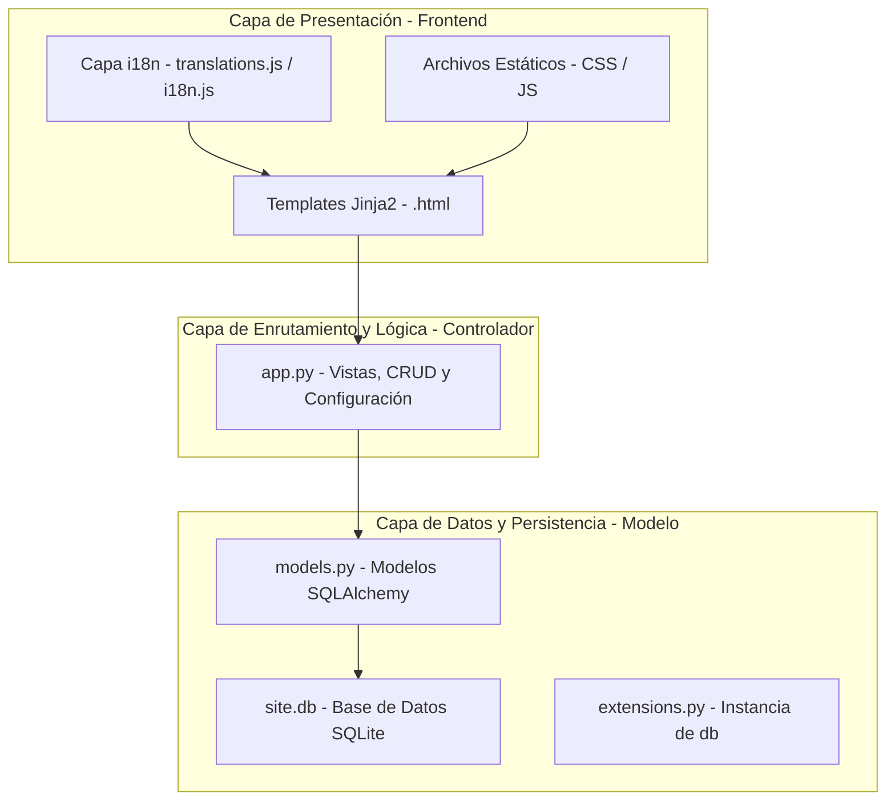

# Documentación de la Arquitectura del Proyecto — AEEEGS

Este documento proporciona una explicación detallada de la estructura del proyecto, dividida por capas lógicas, y detalla la responsabilidad de cada archivo y carpeta dentro del sistema de la Asociación de Estudiantes Ecuatoguineanos en Senegal (AEEEGS).

El sitio web está desarrollado utilizando **Python** con el micro-framework **Flask**, complementado por una base de datos **SQLite** (a través de SQLAlchemy) y un frontend moderno con **HTML5, Javascript Vanilla y Bootstrap 5**.

---

## Estructura de Capas del Proyecto

El proyecto está diseñado bajo un patrón arquitectónico cercano al **MVC** (Modelo-Vista-Controlador):

---

## 1. Capa de Datos y Persistencia (M)

Esta capa se encarga del modelado de la base de datos, las relaciones entre tablas y la integridad de los datos.

### Archivos clave:
*   **[`models.py`](file:///d:/projets/aeeegs-master/models.py)**: Define los modelos de datos que SQLAlchemy mapea directamente a las tablas de la base de datos SQLite.
    *   `Admin`: Almacena las cuentas de administrador con contraseñas cifradas (hash).
    *   `Category`: Categorías para clasificar los artículos del blog (Ej. *Nacionales*, *Académicos*).
    *   `Article`: Los artículos o posts publicados, que contienen un título, subtítulo, cuerpo del contenido, imagen opcional, y referencias al autor y a la categoría.
    *   `Comment`: Comentarios dejados por los visitantes, permitiendo comentarios anidados (respuestas recursivas).
    *   `Like`: Almacena el conteo de likes en cada artículo.
    *   `BoardTerm`: Periodos directivos de la asociación (Ej. 2024-2025), indicando si es el mandato actual.
    *   `Department`: Las "carpetas" o áreas de trabajo de la directiva (Ej. *Cultura*, *Deportes*).
    *   `BoardMember`: Miembros asignados a cada periodo directivo y a sus respectivos departamentos.
*   **[`extensions.py`](file:///d:/projets/aeeegs-master/extensions.py)**: Inicializa el objeto `db` (SQLAlchemy). Esto es crucial para evitar importaciones circulares entre `app.py` y `models.py`.
*   **[`init_db.py`](file:///d:/projets/aeeegs-master/init_db.py)**: Un script de utilidad para inicializar la base de datos de manera limpia, permitiendo su creación inicial antes del primer despliegue.

---

## 2. Capa de Enrutamiento y Lógica de Negocio (C)

Esta capa gestiona las peticiones HTTP que envía el usuario, procesa la información llamando a la capa de datos y decide qué plantilla renderizar.

### Archivo clave:
*   **[`app.py`](file:///d:/projets/aeeegs-master/app.py)**: El motor principal de la aplicación Flask.
    *   **Configuración**: Define configuraciones del servidor de correo (`Flask-Mail`), la ubicación de base de datos y la carpeta para subida de imágenes (`static/uploads`).
    *   **Enrutamiento**: Define las rutas públicas (`/`, `/about`, `/contact`, `/post/<id>`, `/search`) y del panel de administración (`/admin/dashboard`, `/admin/articles`, etc.).
    *   **Lógica CRUD**: Controla el ciclo de vida de los artículos, categorías, directivas y miembros, implementando la validación y el almacenamiento en base de datos.
    *   **Seguridad**: Incluye el decorador `@login_required` para proteger el panel de administración contra accesos no autorizados.
    *   **Envío de correos**: Administra el servicio smtp de envío de mensajes cuando alguien rellena el formulario de contacto.

---

## 3. Capa de Presentación: Plantillas (V)

Esta capa se encarga de estructurar el contenido HTML que se renderiza dinámicamente utilizando el motor de plantillas **Jinja2** de Flask.

### Carpeta clave:
*   **[`templates/`](file:///d:/projets/aeeegs-master/templates)**:
    *   `layout.html`: La plantilla base. Contiene el encabezado común (`<head>`), la barra de navegación (navbar), el pie de página (footer) y la inclusión de scripts y estilos globales. Las demás páginas heredan de esta.
    *   `home.html`: Página de inicio que muestra la barra de búsqueda y la cuadrícula (grid) de artículos con paginación.
    *   `about.html`: Página "Sobre Nosotros", que presenta la descripción de la asociación, el presidente actual, el organigrama administrativo por carpetas y los expresidentes.
    *   `contact.html`: Formulario de contacto y datos de localización de la asociación.
    *   `directiva.html`: Panel público interactivo que permite explorar el equipo directivo actual e histórico mediante un selector de años académicos.
    *   `post.html`: Muestra un artículo completo, permitiendo dejar likes y estructurar los comentarios en árbol.
    *   `search_results.html` y `category_posts.html`: Resultados específicos filtrados por búsqueda o por categoría seleccionada.
    *   `admin/` (Subcarpeta): Plantillas de administración para añadir, editar o eliminar registros de manera visual.

---

## 4. Capa de Recursos Estáticos

Gestiona los archivos que no cambian en el servidor y que el navegador del usuario descarga directamente (imágenes, estilos y scripts del lado del cliente).

### Carpeta clave:
*   **[`static/`](file:///d:/projets/aeeegs-master/static)**:
    *   `css/`: Contiene `styles.css` (estilos básicos del sitio) y `modern-styles.css` (estilos mejorados con efectos de difuminado o "glassmorphism").
    *   `js/`: Contiene `scripts.js` (efectos visuales básicos de interacción como el botón de subir al inicio).
    *   `uploads/`: Carpeta donde se guardan físicamente las imágenes subidas desde el panel de administración.
    *   `assets/`: Contiene los iconos del sitio, el logo corporativo y favicones.

---

## 5. Capa de Localización (Traducción i18n)

Implementa la traducción de todo el sitio web al Español, Francés e Inglés.

### Archivos clave (dentro de `static/js/`):
*   **[`translations.js`](file:///d:/projets/aeeegs-master/static/js/translations.js)**: Funciona como un diccionario de traducción. Define las equivalencias en ES, FR y EN para los textos estáticos del sitio (navbar, pies de página, botones, etiquetas de formularios y placeholders).
*   **[`i18n.js`](file:///d:/projets/aeeegs-master/static/js/i18n.js)**: El motor JavaScript que ejecuta la traducción.
    1.  Lee y aplica instantáneamente el diccionario `translations.js` a las etiquetas del HTML que tienen el atributo `data-i18n`.
    2.  Identifica textos dinámicos que provienen de la base de datos (como el contenido de los artículos y comentarios) mediante la clase `.translatable`, y los traduce en tiempo real usando la API libre de Google Translate.
    3.  Guarda en caché (`sessionStorage`) las traducciones de textos dinámicos para optimizar el rendimiento.
    4.  Mantiene la lengua seleccionada mediante `localStorage` para que persista durante la navegación.

---

## 6. Capa de Configuración y Entorno de Ejecución

Contiene las variables del entorno y las dependencias necesarias para que la aplicación funcione en servidores locales y remotos.

### Archivos clave:
*   **`requirements.txt`**: Lista de dependencias del proyecto Python (`Flask`, `Flask-SQLAlchemy`, `Flask-Mail`, etc.) para una instalación rápida usando `pip install -r requirements.txt`.
*   **`.env.example`**: Archivo plantilla con las variables del entorno necesarias (Clave secreta Flask, credenciales del correo SMTP, URL de base de datos) para configurar el archivo `.env` local.
*   **`Procfile`**: Indica a plataformas en la nube (como Render o Heroku) qué comando ejecutar para iniciar la aplicación en producción (generalmente utilizando `gunicorn`).
